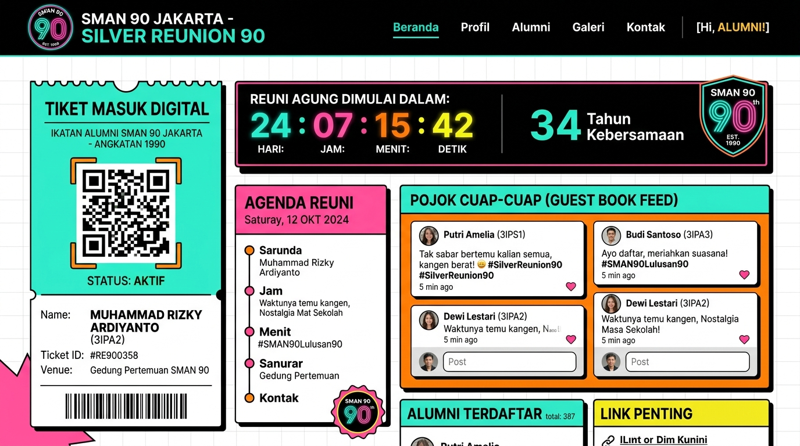

# Silver Reunion 90 SMAN 90 Jakarta - Portal & Pojok Cuap-Cuap 🌐

Welcome to the official full-stack web application of the **Silver Reunion 90 SMAN 90 Jakarta** (Reuni Perak SMUN 90 JKT)! This application serves as a central digital guest book, attendance manager, live countdown, and interactive digital forum for all alumni from the graduating classes of 1998 - 2001.



Live Preview URL: [Development App](https://ais-dev-zskczonhbtabw6hiz6xswe-339082861613.asia-southeast1.run.app) | [Shared App](https://ais-pre-zskczonhbtabw6hiz6xswe-339082861613.asia-southeast1.run.app)

---

## 🛠️ Tech Stack & Architecture

*   **Frontend**: React 18+, Vite, Tailwind CSS, TypeScript, Framer Motion (`motion/react` for smooth transitions), Lucide React (vector iconography), and `qrcode.react` for digital admission badges.
*   **Backend**: Express.js server in TypeScript, bundler compiling backend files via `esbuild` for production reliability.
*   **Database**: Supabase PostgreSQL database handling structured relational tables with dynamic client querying via robust API routes.

---

## ✨ Main Features Extracted

Here are the key functional features implemented in the system:

### 📱 1. Alumni Self-Service Onboarding & Login
*   **WhatsApp Passwordless Entry**: Alumni log in securely by inputting their registered WhatsApp number and selecting their specific high school alumni class.
*   **Session Persistence**: State is stored locally in the browser’s `localStorage` (`reunion_user`), ensuring that users stay logged in when they return.
*   **Draggable Logout Utility**: A creative, interactive button that allows users to log out by clicking, or reposition it anywhere on the screen by dragging.

### 🎟️ 2. Dynamic Digital Ticket & Check-in QR
*   **Unique Digital Ticket**: Evaluates and displays a verified badge showing the alumnus's name, nickname, and class identifier.
*   **Interactive QR Code Generator**: Renders a clean QR code embedding each user's unique identification link. This can be scanned at the venue door for instant verification.
*   **Automated Google Calendar Sync**: Fast "Add to Calendar" link with pre-filled details about the event, time, location, and map directions.

### ⏱️ 3. Real-Time Countdown & Live Event Stats
*   **Precision Countdown**: Features an elegant, ticking live countdown to **6 Juni 2026 at 13:00 WIB**, building excitement as the reunion approaches.
*   **Live Attendance Statistics**: Dynamic real-time charts or numeric boxes summarizing:
    *   *Total Registered and Paid Alumni*
    *   *Total Checked-In Guests*
    *   *Check-In Metrics & Visual Percentages*

### 🗺️ 4. Venue & Session Navigation Hub
*   **Milestone Star Cafe Bintaro Map Location**: Includes full address coordinates, custom map icons, and a direct Google Maps linking template.
*   **Photo Slider**: Features a slide carousel showcasing the beautiful venue spots.
*   **Time & Schedule Sequence**: Smoothly rendered timeline showing the complete event schedule of the reunion day.
*   **Nostalgic Performance Showcase**: Features special musical guests, live bands, and jamming session times.

### 💌 5. Interactive "Pojok Cuap-Cuap Alumni" (Guest Book & Interaction Forum)
*   **Real-time Group Chat / Billboard**: Logged-in alumni can write messages of nostalgia, greetings, and feedback.
*   **Instant Message Modal Popups**: A seamless popup form triggered by clicking **"Tulis Pesan Kesan"** directly beneath the page header.
*   **High-Fidelity Emoji Reaction Console**: Select and read customizable reaction emojis (Smile, Heart, Shock, Prayer) appended to other alumni's feedback cards.
*   **Multi-tier Threading & Replies**: Supports nested comment threads, lets alumni reply directly to others, making real-time discussions highly organized.

---

## 🚀 How to Run the App Locally

### 1. Requirements
Ensure you have **Node.js** (v18 or higher) and npm installed.

### 2. Environment Setup
Create a `.env` or write credentials to `.env.example` at the root:
```env
SUPABASE_URL=your_supabase_url
SUPABASE_KEY=your_supabase_anon_or_service_key
```

### 3. Installation
Install core dependencies:
```bash
npm install
```

### 4. Development Server
Start the Express server integrated with the Vite middleware:
```bash
npm run dev
```
The server will boot up and bind to `http://localhost:3000`.

### 5. Production Build & Start
Compile the client spa assets and bundle the typescript backend sever cleanly:
```bash
npm run build
npm start
```
This produces optimized production assets under `dist/` and fires up `dist/server.cjs`.
